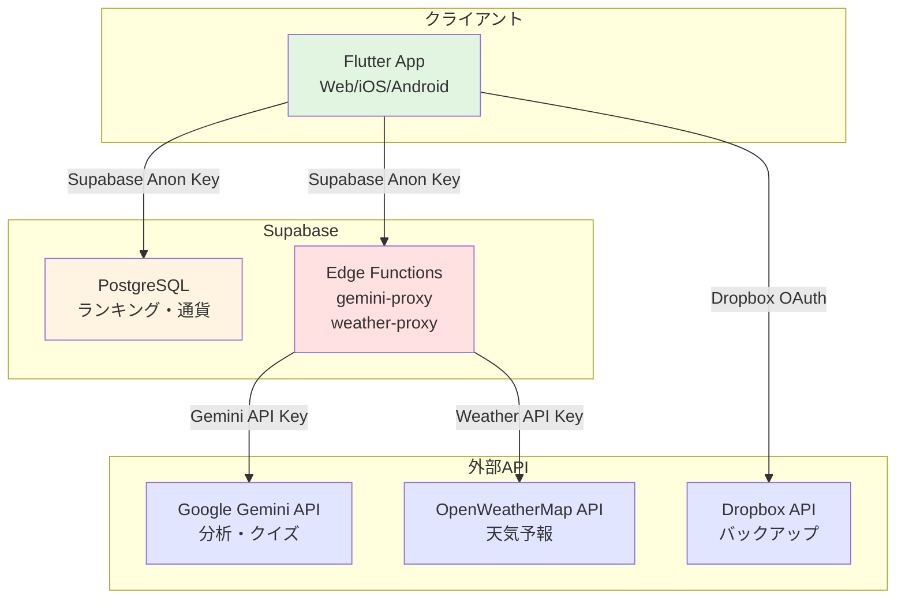

# Zzzone - 睡眠管理アプリ

<div align="center">

**日々の睡眠を記録・可視化して、全国のユーザーと競い合う健康的な睡眠習慣サポートアプリ**

[](https://flutter.dev/)
[](https://dart.dev/)
[](https://supabase.com/)

[Web版デモ](https://shu5555.github.io/Zzzone/) | [機能紹介](#主な機能)

</div>

---

## 📚 目次

- [概要](#概要)
- [主な機能](#主な機能)
- [技術スタック](#技術スタック)
- [アーキテクチャ](#アーキテクチャ)
- [開発環境のセットアップ](#開発環境のセットアップ)
- [API管理とセキュリティ](#api管理とセキュリティ)
- [デプロイメント](#デプロイメント)
- [開発者情報](#開発者情報)

---

## 概要

Zzzoneは、日々の睡眠を記録・可視化して、全国のユーザーと睡眠時間を競い合うことで、健康的で楽しい睡眠習慣をサポートするクロスプラットフォームアプリケーションです。

**特徴:**
- 🎯 睡眠記録と多角的な評価
- 🎰 偉人の名言を集めるガチャ機能
- 🤖 AI（Google Gemini）による睡眠分析
- 🏆 全国ランキングで競争
- ☁️ Dropboxバックアップ対応
- 🌐 Web版とモバイル版の両方に対応

---

## 主な機能

### 1. 睡眠記録と評価
- **自動計測・手動記録**: 日々の睡眠を手軽に、または詳細に記録
- **睡眠評価**: スコア、体感パフォーマンス、二度寝の有無など多角的に評価
- **目標達成**: 設定した目標入眠時刻を守ってゲーム感覚で睡眠習慣を改善

### 2. ガチャ機能と名言コレクション
- **名言ガチャ**: スリープコインで古今東西の偉人の名言を獲得
- **レアリティシステム**: コモン、レア、激レア、超激レアの4段階
- **10連ガチャ**: お得に10個の名言を一度に獲得
- **超激レア確定ガチャチケット**: 100ポイントで交換可能
- **名言の検索とコピー**: キーワード検索と長押しコピー機能

### 3. ホーム画面のカスタマイズ
- **お気に入り名言**: 獲得した名言をホーム画面に表示
- **ランダムモード**: 日替わりで異なる名言を表示

### 4. AI分析機能
- **睡眠分析**: Google Gemini 2.5 Proが5〜30件の記録を分析
- **総合得点**: 睡眠の質・量・規則性を100点満点で評価
- **パーソナライズ**: 昼間の眠気、二度寝の状況も考慮
- **AIアシスタント設定**: 18種類の口調から選択可能

### 5. クイズ機能
- **日替わりクイズ**: Google Gemini 2.5 Flashが毎日1問出題
- **報酬**: 正解で100スリープコイン獲得
- **進捗保存**: 回答と解説を自動保存

### 6. ランキング機能
- **睡眠時間ランキング**: 全国のユーザーと睡眠時間を競争
- **AIスコアランキング**: AI評価の総合得点で競争
- **名言ランキング**: ランカーのお気に入り名言を閲覧

### 7. その他の機能
- **天気予報**: ホーム画面に現在の天気と今後の予報を表示
- **ギフトコード**: 特別なアイテムを獲得
- **ぐっすりサタデー**: 金曜深夜〜土曜朝にコイン2倍
- **お知らせ機能**: アプリの更新情報を通知
- **Dropboxバックアップ**: データの安全なバックアップと復元

---

## 技術スタック

### クライアント
| 技術 | 用途 |
|------|------|
| Flutter 3.35.6 | クロスプラットフォームフレームワーク |
| Dart 3.9.2 | プログラミング言語 |
| SQLite (`sqflite`) | ローカルデータベース（モバイル） |
| `shared_preferences` | 設定保存・Web版データストア |
| `flutter_dotenv` | 環境変数管理（デバッグモード） |
| `http` | HTTPクライアント |

### バックエンド
| サービス | 用途 |
|----------|------|
| Supabase | ランキング・通貨・ギフトコード管理 |
| Supabase Edge Functions | APIプロキシ（セキュリティ層） |
| Google Gemini 2.5 Pro | AI睡眠分析 |
| Google Gemini 2.5 Flash | クイズ生成・判定 |
| OpenWeatherMap API | 天気予報 |
| Dropbox API | データバックアップ |

---

## アーキテクチャ

### システム構成図



### Web版とモバイル版の違い

| 項目 | Web版 | モバイル版 |
|------|-------|-----------|
| **APIアクセス** | Supabase Edge Functions経由 | 直接APIアクセス |
| **APIキー** | サーバー側で管理 | クライアント側で管理 |
| **データベース** | `shared_preferences` + メモリ | SQLite |
| **バックアップ形式** | JSON | ZIP |

### データフロー

#### Web版（推奨アーキテクチャ）
```
Web App → Edge Functions → External API
         (Anon Key)      (API Key)
```

- **セキュリティ**: APIキーはEdge Functionsで管理、クライアント側には露出しない
- **認証**: Supabase Anon Keyのみ使用（公開されても問題ないキー）

#### モバイル版
```
Mobile App → External API
          (API Key)
```

- **利便性**: オフラインでの動作も視野に入れた直接アクセス
- **セキュリティ**: APIキーはビルド時の環境変数で管理

---

## 開発環境のセットアップ

### 前提条件

- Flutter SDK 3.35.6以上
- Dart 3.9.2以上
- Git
- エディタ（VS Code推奨）

### 1. リポジトリのクローン

```bash
git clone https://github.com/Shu5555/Zzzone.git
cd Zzzone
```

### 2. 依存関係のインストール

```bash
flutter pub get
```

### 3. 環境変数の設定

#### デバッグモード用

`assets/.env`ファイルを作成し、以下の内容を設定：

```env
# Supabase設定
SUPABASE_URL=https://your-project.supabase.co
SUPABASE_ANON_KEY=your-anon-key

# API Keys (モバイル版で使用)
GEMINI_API_KEY=your-gemini-api-key
OPENWEATHERMAP_API_KEY=your-openweathermap-api-key
```

> **⚠️ 重要**: `.env`ファイルは`.gitignore`に含まれており、Gitにコミットされません。

#### リリースモード用

ビルド時に環境変数を指定：

```bash
flutter build web --release \
  --dart-define=SUPABASE_URL=https://your-project.supabase.co \
  --dart-define=SUPABASE_ANON_KEY=your-anon-key \
  --dart-define=GEMINI_API_KEY=your-gemini-api-key \
  --dart-define=OPENWEATHERMAP_API_KEY=your-openweathermap-api-key
```

### 4. Supabase Edge Functionsのデプロイ

詳細は[DEPLOYMENT_GUIDE.md](./DEPLOYMENT_GUIDE.md)を参照してください。

```bash
cd supabase/functions
supabase functions deploy gemini-proxy
supabase functions deploy weather-proxy
```

Edge Functionsのシークレット設定：

```bash
supabase secrets set GEMINI_API_KEY=your-gemini-api-key
supabase secrets set OPENWEATHERMAP_API_KEY=your-openweathermap-api-key
```

### 5. 実行

#### Web版
```bash
flutter run -d chrome
```

#### モバイル版
```bash
# Android
flutter run -d android

# iOS
flutter run -d ios
```

---

## API管理とセキュリティ

### APIキーの管理方針

#### 🔐 セキュリティレベル

| APIキー | 露出リスク | 管理方法 |
|---------|-----------|----------|
| **Supabase Anon Key** | 低（公開可） | クライアント側で使用 |
| **Gemini API Key** | 高（秘匿必須） | Edge Functionsで管理 |
| **Weather API Key** | 高（秘匿必須） | Edge Functionsで管理 |

#### Web版のセキュリティアーキテクチャ

**問題**: クライアント側のJavaScriptに含まれるAPIキーは容易に取得可能

**解決策**: Supabase Edge Functionsをプロキシとして使用

```dart
// ❌ 悪い例（APIキーが露出）
final response = await http.post(
  Uri.parse('https://generativelanguage.googleapis.com/v1beta/models/gemini...'),
  headers: {'X-goog-api-key': geminiApiKey}, // このキーが露出！
);

// ✅ 良い例（Edge Functions経由）
final response = await http.post(
  Uri.parse('$supabaseUrl/functions/v1/gemini-proxy'),
  headers: {'Authorization': 'Bearer $supabaseAnonKey'}, // 公開キーのみ
  body: jsonEncode({'prompt': prompt}),
);
```

### 環境変数の読み込みロジック

```dart
// デバッグモードとリリースモードで自動切り替え
final apiKey = kDebugMode
    ? (dotenv.env['GEMINI_API_KEY'] ?? '')      // デバッグ: .envから
    : const String.fromEnvironment('GEMINI_API_KEY'); // リリース: ビルド時変数
```

### セキュリティチェックリスト

- [x] APIキーは`.env`ファイルに保存（`.gitignore`で除外）
- [x] Web版はEdge Functions経由でAPIアクセス
- [x] ビルド時に環境変数を指定
- [x] GitHub ActionsのSecretsで環境変数を管理
- [x] Edge FunctionsのシークレットでAPIキーを管理

詳細なセキュリティ監査レポートは[こちら](./docs/security_audit_report.md)を参照してください。

---

## デプロイメント

### Web版（GitHub Pages）

GitHub Actionsで自動デプロイされます。

**必要な設定**:
1. GitHubリポジトリの Settings > Secrets and variables > Actions
2. 以下のSecretsを追加：
   - `SUPABASE_URL`
   - `SUPABASE_ANON_KEY`
   - `GEMINI_API_KEY`
   - `OPENWEATHERMAP_API_KEY`

**デプロイURL**: https://shu5555.github.io/Zzzone/

### モバイル版

詳細は[DEPLOYMENT_GUIDE.md](./DEPLOYMENT_GUIDE.md)を参照してください。

---

## バックアップと復元の注意事項

> **⚠️ 重要**: モバイル版とWeb版ではバックアップ形式が異なります
> - **モバイル版**: ZIP形式
> - **Web版**: JSON形式
> 
> **同じプラットフォーム間でのみバックアップ・復元が可能です。**

---

## お知らせ機能の更新方法

現在（v5）、お知らせの更新にはアプリの再ビルドが必要です。

1. `assets/announcements.json`を開く
2. 新しいお知らせを配列の先頭に追加：
```json
{
  "id": "unique-id-2025-01-01",
  "createdAt": "2025-01-01T12:00:00+09:00",
  "title": "新機能追加",
  "body": "新しい機能が追加されました..."
}
```
3. アプリを再ビルド

> **Note**: 将来的にはアプリのアップデートなしで更新できる仕組みへの移行を計画しています。

---

## 開発者情報

- **アプリ名**: Zzzone（ズォーン）
- **制作者**: kou09427, syuu55
- **共同編集**: Gemini-1.5-pro / Gemini-2.0-flash-thinking-exp-01-21
- **リポジトリ**: https://github.com/Shu5555/Zzzone
- **Web版デモ**: https://shu5555.github.io/Zzzone/

---

## ライセンス

This project is proprietary software. All rights reserved.

---

<div align="center">

**Made with ❤️ using Flutter and AI**

</div>